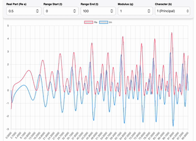

# **L-Function Calculator (CPP-LFunction)**

A high-performance C++ application for computing and visualizing **L-Functions** using the [FLINT](https://flintlib.org/) (Fast Library for Number Theory) and [Arb](https://arblib.org/) libraries.

This project combines a modern **C++23** backend with a lightweight **HTML/JS frontend**, allowing users to perform complex number-theoretic computations directly from their web browser.

## 🎥 Demos



## **🚀 Quick Start (For Non-Developers)**

_Use this method if you just want to run the application without writing code._

### **1. Prerequisites**

-   **Docker Desktop**: Download and install it from [docker.com](https://www.docker.com/products/docker-desktop/).

-   _Note: Ensure Docker is running (look for the whale icon in your taskbar)._

### **2. How to Run**

1. **Download** this repository (Click the green **Code** button -> **Download ZIP**) and unzip it.

2. Open a terminal (Command Prompt or PowerShell on Windows, Terminal on Mac).

3. Navigate to the project folder.

4. Run the following command:

```bash
docker compose up
```

5. Wait for the build to finish (this may take a few minutes the first time as it compiles the math libraries).

6. Open your browser and go to: 👉 **http://localhost:8080**

To stop the application, press `Ctrl+C` in the terminal.

## **🛠️ Development (For Developers)**

_Use this method if you want to modify the C++ code or frontend._

### **Option A: VS Code Dev Container (Recommended)**

This project is configured with a **Dev Container**. This ensures you have the exact C++ compiler (GCC-14), CMake, and math libraries pre-installed without polluting your local machine.

1. Install **VS Code** and the **Dev Containers** extension.

2. Open this folder in VS Code.

3. Click **"Reopen in Container"** when prompted (or run `Dev Containers: Reopen in Container` from the command palette).

4. Once inside, you can build and run using the provided CMake tools or terminal:

```bash
mkdir build && cd build
cmake ..
make -j$(nproc)
./LFunctionServer
```

### **Option B: Local Manual Build**

If you prefer not to use Docker, you must have the following installed on your host machine:

-   **C++ Compiler**: GCC 14+ or Clang 18+ (Must support C++23).

-   **CMake**: Version 3.16+.

-   **Libraries**: `libflint`, `libarb`, `libgmp`, `libmpfr`.

```bash
# Ubuntu/Debian example
sudo apt install gcc-14 g++-14 cmake libflint-dev libarb-dev libgmp-dev libmpfr-dev
```

## **📂 File Structure**

```
CPP-LFunction/
├── .devcontainer/       # Configuration for VS Code Dev Containers
├── include/             # C++ Header files (.hpp)
├── src/                 # C++ Source files (.cpp)
│   ├── main.cpp         # Entry point & Web Server (Crow) configuration
│   └── l_functions...   # Mathematical implementation logic
├── static/              # Frontend Assets (HTML, CSS, JS)
│   ├── index.html       # The main web interface
│   └── css/             # Stylesheets
├── Dockerfile           # Multi-stage build for production (Small size)
├── compose.yaml         # Docker Compose file for easy launching
├── CMakeLists.txt       # Build system configuration
└── README.md            # Project documentation
```

## **⚙️ Performance Notes**

-   **Docker Production Build:** The `Dockerfile` provided is a **multi-stage build**. It compiles the code in a heavy environment but runs it in a lightweight container.

-   **Optimization:** The build is configured to use `Release` mode with `-O3` optimizations by default when using Docker Compose, ensuring maximum speed for heavy computations.

## **📄 License**

This project is open-source.

-   **FLINT/Arb** libraries are subject to their respective licenses (LGPL/GPL).
